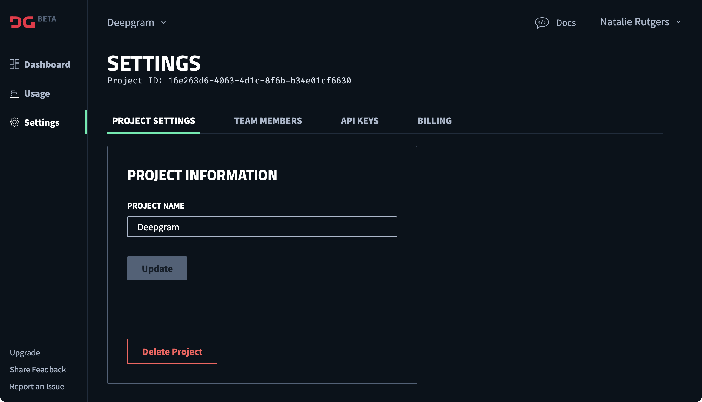
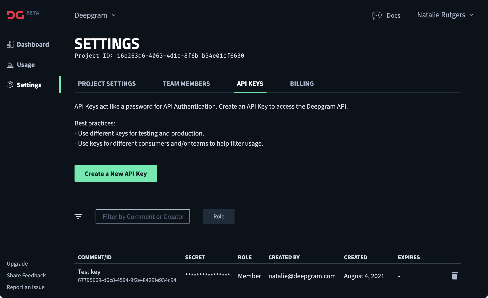

import Alert from '../../../../shared/components/global/Alert.astro'; 
import Panel from '../../../../shared/components/global/Panel.astro'; 

We are actively migrating customers to our new Console and Deepgram API. Don't worry, though--you will be able to test and try the new console with free credits first, and you can choose when you want to migrate within our migration window.

# {frontmatter.title}

<Alert type="info">

If you get stuck at any point, help is just a click away! [Contact Support](/support/).

</Alert>

Ready to get started?

## Set Up in Deepgram's New Console

Deepgram's Console provides you with the following new features:

- Easier ability to manage, support and track your integration with Deepgram.
- Improved dashboard to show usage, costs, and billing information
- Better role and API key management
- Better organization, tracking, and billing of different projects
- Easier connection to documentation and example use cases

	<iframe
		src="https://www.loom.com/embed/d71314d806384f208609772c17fd9cba"
		frameborder="0"
		webkitallowfullscreen
		mozallowfullscreen
		allowfullscreen
		style="position: absolute; top: 0; left: 0; width: 100%; height: 100%;"
	></iframe>

To get set up in Deepgram's new Console:

1. Choose an individual on your team who you would like to own your Deepgram account, and have that individual sign up at [console.deepgram.com](https://console.deepgram.com) using a company email address.

   <Alert type="info">

   Additional owners can be added by the initial account owner after they sign up.

   </Alert>

2. After signup, the Console will direct you to a quick demo. You can complete this demo or skip to the Dashboard.

3. From the Dashboard, you’ll notice that your first project has been created for you. We have automatically loaded this project with $150 of credit for you to use while testing.

   <Alert type="info">

   A Project organizes all of your Deepgram resources and consists of a set of users, a set of API Keys, and billing and monitoring settings.

   You can create as many Projects as you need. To learn about when to create new projects, see [Using Multiple Projects](/documentation/getting-started/multiple-projects/).

   </Alert>

4. Change the name of the project to your company name in **Settings**, and note your **Project ID**.

   <Alert type="warning">

   Please share your Project ID with your Deepgram CSM. We'll use it to tie your contract to your console account, which will ensure your service isn't interrupted after you've used your free credits. We’ll also use it to grant you access to any custom models you’ve purchased.

   </Alert>

   

5. Invite your team members in **Settings** > **Team Members**. You can assign each team member a permission level. To learn more about permissions and see what different roles can do, read [Working with Roles](/documentation/getting-started/roles/).

6. Create API Keys in **Settings** > **Team Members**. You can create as many API keys as you like and, similar to team members, assign each API Key a permission level. Usage associated with individual API Keys will be reflected in your Project.

   

## Migrate to the Deepgram API

Now that you are set up on the new Deepgram Console, you must change your API endpoints to point to the new Deepgram API.

1. Submit some test API calls to retrieve transcripts.

   To help you, we’ve put together some Quickstart Guides to make it easy to transcribe [pre-recorded (batch)](/documentation/getting-started/prerecorded/) or [real-time streaming](/documentation/getting-started/streaming/) audio. Our Quickstarts use the two new SDKs we've released to make it easier to integrate with Deepgram: [Node.js SDK](https://github.com/deepgram/node-sdk) and [Python SDK](https://github.com/deepgram/deepgram-python-sdk).

   <Panel title="Differences in APIs">

   A few key differences exist between the new Deepgram API and our legacy APIs:

   ### Authentication

   You will now need to authenticate with an API Key using token authentication, rather than basic auth. To learn more, see [Deepgram API Reference: Authentication](/api-reference/#authentication).

   ### API Requests

   Our API request endpoints have changed as follows:

   **General Requests**

   Move from: 
   `https://brain.deepgram.com/v2`

   To: 
   `https://api.deepgram.com/v1`

   **Batch Requests**

   Move from: 
   `https://brain.deepgram.com/v2/listen`

   To: 
   `https://api.deepgram.com/v1/listen` |

   **Streaming Requests**

   **Base:**

   Move from: 
   `wss://brain.deepgram.com/v2/listen/stream`

   To: 
   `wss://api.deepgram.com/v1/listen`

   **Fast:**

   Move from: 
   `wss://cab2b5852c84ae12.deepgram.com/v2/listen/stream`

   To: 
   `wss://api.deepgram.com/v1/listen`

   ### API Responses

   Our API responses have changed as follows:

   For the [Transcribe Streaming Endpoint](/api-reference/#transcription-streaming), the [Interim Results](/api-reference/#interim-results-str) feature will be turned off by default. The streaming response will not return interim results unless your original request includes `interim_results=true`.

   Otherwise, you still request features and receive responses exactly as you’ve done in the past. To learn more about request and response formatting and to see a full list of features, view our [Deepgram API Reference: Transcription](/api-reference/#transcription).

   </Panel>

2. After sending a few test requests, take the opportunity to review your Usage in the Console or by querying a few methods available through [our Usage endpoint](/api-reference/#usage).

   <Panel title="Differences in Usage">

   Based on your feedback, we’ve made it easier to track your usage by time period and by feature. Usage is also now tracked and requested per Project.

   You can view usage either through the Console, where we've included a **Logs** view to make it simple to debug, or through our API's [Usage endpoint](/api-reference/#usage).

   </Panel>

3. When you're comfortable, integrate the new API into your production environment, and let your CSM know. We’ll ask for your Console Project ID and will update your account to reflect your contract.

4. Enjoy the benefits of the API and Console. And as always, let us know if you would like to share any feedback with the team.
